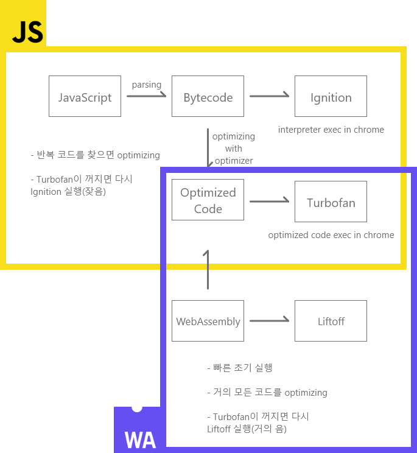

# WebAssembly

-   브라우저에서 새로 실행 가능한 파일 형식(.wasm)
-   원래 쓰던 언어를 변환하는 식으로 사용
-   TS와 문법이 비슷

## 장점

1. 다른 언어로 작성한 프로그램도 브라우저에서 실행 가능

    - 이미지 압축 웹 서비스(C++)
    - 웹 캐드
    - 유니티
    - 옛날 프로그램들(게임, Windows98)

2. 작동 속도가 빠름
    - 최적화가 매우 잘된 자바스크립트와 비슷
