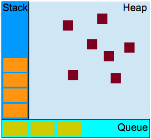

## Rendering

    HTML + CSS + JS 문서를 해석해서 브라우저에 출력
    SSR : 서버에서 HTML로 변환 후 브라우저에 전달
    (detail in ch38)

#

## Ajax(Asynchronous JavaScript and XML)

    자바스크릅티를 이용해 서버와 브라우저가 비동기 방식으로
    데이터를 교환할 수 있는 통신 기능
    (XMLHttpRequest)

-   데이터 전달 형태

    -   JSON
    -   XML
    -   HTML
    -   텍스트 파일 등

-   장점

    1. 웹 페이지 전체를 다시 로딩하지 않고도, 웹 페이지의 일부분만을 갱신할 수 있습니다.

    2. 웹 페이지가 로드된 후에 서버로 데이터 요청을 보낼 수 있습니다.

    3. 웹 페이지가 로드된 후에 서버로부터 데이터를 받을 수 있습니다.

    4. 백그라운드 영역에서 서버로 데이터를 보낼 수 있습니다.

-   한계

    1. Ajax는 클라이언트가 서버에 데이터를 요청하는 클라이언트 풀링 방식을 사용하므로, 서버 푸시 방식의 실시간 서비스는 만들 수 없습니다.

    2. Ajax로는 바이너리 데이터를 보내거나 받을 수 없습니다.

    3. Ajax 스크립트가 포함된 서버가 아닌 다른 서버로 Ajax 요청을 보낼 수는 없습니다.

    4. 클라이언트의 PC로 Ajax 요청을 보낼 수는 없습니다.

#

## (추가 - V8, Node.js)

#

## ECMAscript

    자바 스크립트의 표준 사양(ECMA-262)

    클라이언트 사이드 Web API, DOM, XMLHttpRequest,
    fetch, SVG, Web Storage, Web Worker...

-   Web API : 사이트가 실행되고 있는 브라우저와 운영 체제의 다양한 부분 그리고 웹 사이트 혹은 서비스의 데이터를 다룰 수 있는 인터페이스입니다.

#

## 자바스크립트

    자바스크립트는 하나의 스레드로 단 1개의 동시성만 다루는 언어입니다.

    자바스크립트는 힙, 큐와 함께 구성하는 단일 콜스택을 갖습니다. 이것은 V8 내부에 구현되어 있습니다.

-   특징
    -   싱글스레드
    -   인터프리터 언어
    -   명령형, 함수형, 프로토타입 기반 객체지향

    

-   스택

    함수의 호출을 기록하는 자료구조입니다. 기본적으로 우리가 프로그램 안에서 위치한 곳이죠. 만약 우리가 어떤 함수를 실행시킨다면, 우리는 스택 위에 무언가를 올리는(push) 행위를 하는 겁니다. 그리고 우리가 함수로 부터 반환을 받을 때, 우리는 스택의 맨 위를 가져오는(pop) 것이죠.

-   힙

    오브젝트(객체)들은 힙 내부에 할당됩니다. 힙은 거의 구조화되지 않은 영역(unstructured)의 메모리입니다. 변수와 객체들의 모든 메모리 할당이 여기서 일어나게 됩니다.

-   큐

    자바스크립트 런타임은 메시지 큐를 갖고 있습니다. 메시지 큐는 실행될 콜백함수나 실행될 메시지들에 대한 리스트입니다.

-   이벤트 루프

    큐 안의 콜백들을 스택이 비었을 때 밀어넣는 일을 담당합니다.

-   비동기 실행 방식

    1. 스택에서 이벤트 요청(자바스크립트의 스택)
    2. Web API에서 실행(멀티 스레드)
    3. 이벤트가 완료 됐다면 인큐(자바스크립트의 큐)
    4. 이벤트 루프가 스택의 상태를 확인하고 큐의 첫 번째 콜백을 스택에 옮김

#

### 참고

-   [데이터 전달형태, 장점, 한계 - TCP School] http://tcpschool.com/ajax/ajax_intro_basic
-   [Web API 정의] https://developer.mozilla.org/ko/docs/Learn/JavaScript/Client-side_web_APIs
-   [Web API 명세] https://developer.mozilla.org/ko/docs/Web/API
-   [자바스크립트 콜스택] https://velog.io/@jakeseo_me/2019-03-15-2303-%EC%9E%91%EC%84%B1%EB%90%A8-rmjta5a3xh
