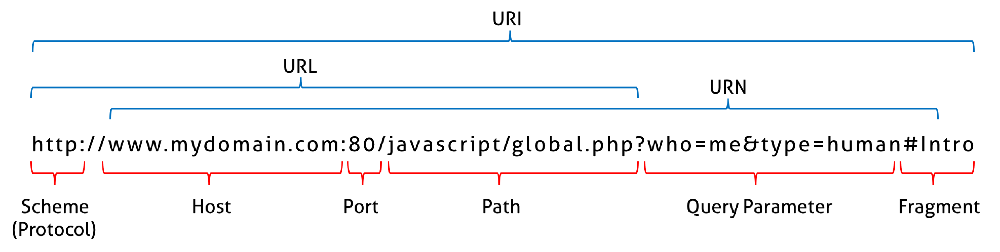

## 브라우저의 렌더링 과정

1. 브라우저가 렌더링에 필요한 리소스를 서버에 요청한다.
2. 브라우저의 렌더링 엔진은 서버로부터 받은 리소스(HTML, CSS)를 파싱하여 DOM, CSSOM을 생성하고
   이들을 결합하여 렌더 트리를 생성한다.
3. 브라우저의 자바스크립트 엔진은 서버로부터 받은 자바스크립트를 파싱하여 AST를 생성하고
   바이트코드로 변환하여 실행한다. 이 때 자바스크립트는 DOM API를 통해 CSSOM을 변경할 수 있다.
   변경된 것은 다시 렌더 트리로 결합된다.
4. 렌더 트리를 기반으로 HTML 요소의 레이아웃을 계산하고 브라우저 화면에 페인팅한다.

#

## 요청과 응답

    렌더링에 필요한 리소스는 모두 서버에 존재하므로
    브라우저는 요청 후 응답받은 리소스를 파싱하여 렌더링한다.

    URL을 입력하고 엔터 키를 누르면
    URL의 호스트 이름이 DNS를 통해 IP 주소로 변환되고
    이 IP 주소를 갖는 서버에게 요청한다.

    

