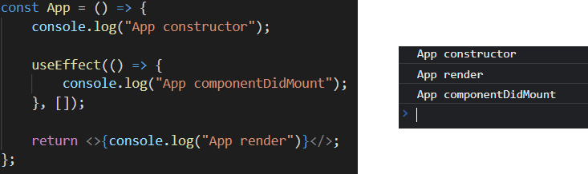
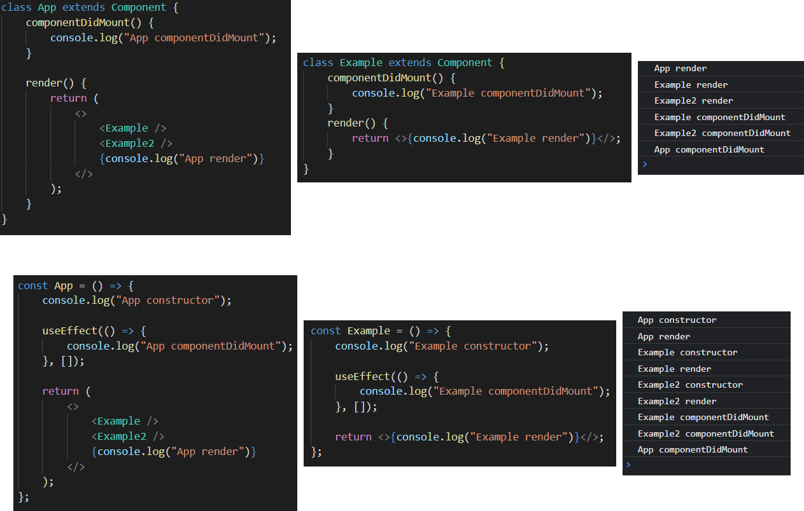
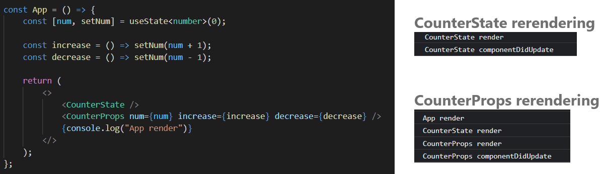

## 라이프사이클

[라이프사이클 이미지] https://projects.wojtekmaj.pl/react-lifecycle-methods-diagram/

#

## 브라우저 렌더링 과정

    1. DOM 트리 생성
    2. CSSOM 트리 생성
    3. render 트리 생성
    4. javascript 적용
    5. reflow(layout, 뷰포트 내 위치 계산)
    6. repaint

    => DOM 트리 수정할 때마다 3, 4, 5 반복 => 성능 저하

#

## Virtual DOM: DOM 구조와 비슷한 react 객체

    1. Virtual DOM 트리 생성
    2. DOM, Virtual DOM 차이점 파악
    3. 한 번에 반영(리렌더링)

#

## react 첫 렌더링

    1.  DOM -> CSSOM -> render 생성
    2.  javascript(react) 적용

        1. App render
           1. Example render
           2. Example2 render
           3. App render 완료
        2. DOM에 적용(마운트)
        3. 각 componentDidMount 실행

    3.  reflow(layout, 뷰포트 내 위치 계산)
    4.  repaint

[참고] https://react.vlpt.us/basic/25-lifecycle.html

#

## react 리렌더링

    -   조건
        1. state 업데이트
        2. props 업데이트
        3. 부모 컴포넌트 렌더링시
        4. shouldComponentUpdate에서 true 반환시
        5. forceUpdate 실행

=> CounterProps update의 경우 App의 State의 변경이기 때문에 App을 리렌더링한다.
