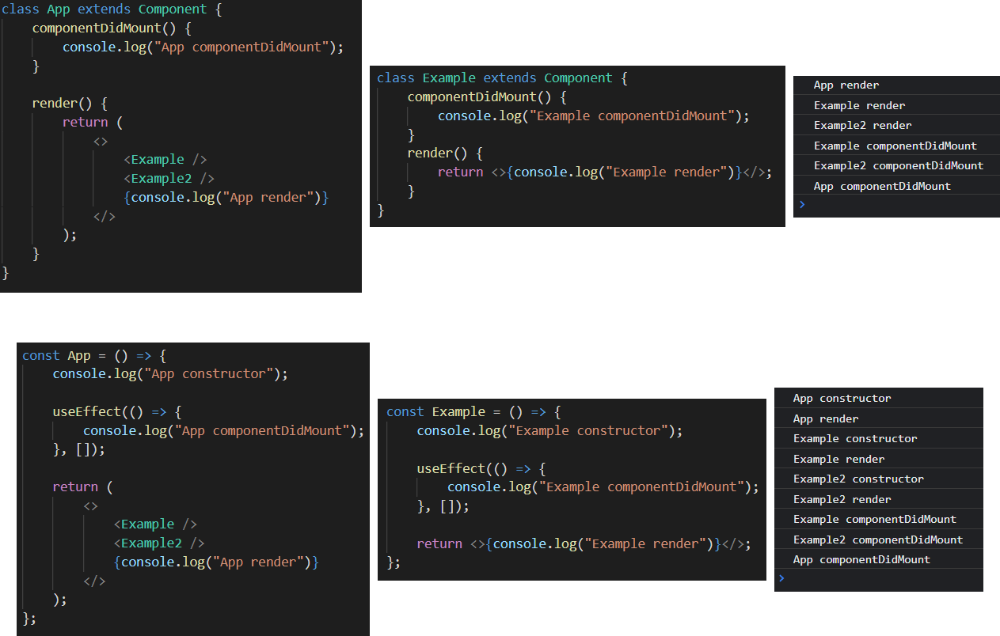

# React

## 라이프사이클


[라이프사이클 이미지] https://projects.wojtekmaj.pl/react-lifecycle-methods-diagram/

#

## 브라우저 렌더링 과정

    1. DOM 트리 생성
    2. CSSOM 트리 생성
    3. render 트리 생성
    4. javascript 적용
    5. reflow(layout, 뷰포트 내 위치 계산)
    6. repaint

    => DOM 트리 수정할 때마다 3, 4, 5 반복 => 성능 저하

#

## Virtual DOM: DOM 구조와 비슷한 react 객체

    1. Virtual DOM 트리 생성
    2. DOM, Virtual DOM 차이점 파악
    3. 한 번에 반영(리렌더링)

#

## react 첫 렌더링



    1.  DOM -> CSSOM -> render 생성
    2.  javascript(react) 적용

        1. App render
           1. Example render
           2. Example2 render
           3. App render 완료
        2. DOM에 적용(마운트)
        3. 각 componentDidMount 실행

    3.  reflow(layout, 뷰포트 내 위치 계산)
    4.  repaint

[참고] https://react.vlpt.us/basic/25-lifecycle.html

#

## react 리렌더링

    -   조건
        1. state 업데이트
        2. props 업데이트
        3. 부모 컴포넌트 렌더링시
        4. shouldComponentUpdate에서 true 반환시
        5. forceUpdate 실행


=> CounterProps update의 경우 App의 State의 변경이기 때문에 App을 리렌더링한다.

#

## useState

```javascript
const [state, setState] = useState();

setState((prevState) => {}); // 새로 바뀌는 상태가 이전 상태와 연관 있을 때

const [state, setState] = useState(heavyWork()); // 리렌더링 마다 실행
const [state, setState] = useState(() => heavyWork()); // 처음 한 번만 실행
```

#

## useEffeect

```javascript
useEffect(() => {}, [dependencies]);

useEffect(() => {
    return () => {}; // clean up
}, [dependencies]);
```

#

## useRef

```javascript
// 컴포넌트가 unmount되기 전까지 값을 유지 및 변경할 수 있고
// 리렌더링이 발생하지 않는다.
// 저장공간으로 이용, DOM 요소 접근

const ref = useRef(refValue); // ref 객체 반환 ({current: refValue})
```

|                        | const, let     | state | ref |
| ---------------------- | -------------- | ----- | --- |
| 리렌더링 발생          | x              | o     | x   |
| 리렌더링시 변경값 유지 | x(다시 초기화) | o     | o   |

#

## useContext

```javascript
// ContextExample.js
import { createContext } from "react";

export const ContextExample = createContext(null);
```

```javascript
// App.jsx
import { ContextExample } from "./contexts/ContextExample";

const App = () => {
    return (
        <ContextExample.Provider value={{ num }}>
            <div>
                {
                    // const context = useContext(ContextExample)
                    // <p>{context.num}</p>
                }
            </div>
        </ContextExample.Provider>
    );
};

export default App;
```

    Context.Provider의 자식노드는 Context에 해당하는 상태와 상관없어도 리렌더링이 발생한다.

    관련있는 Provider로 각각 감싸주더라도 코드량, 가독성 등의 문제가 있다.

#

## useMemo

```javascript
const obj = useMemo(() => {
    return {};
}, [dependencies]);

const fn = useMemo(() => {}, [dependencies]);
```

#

## useCallback

```javascript
const obj = useCallback(() => {
    return {};
}, [dependencies]);

const fn = useCallback(() => {}, [dependencies]);
```

#

## useMemo useCallback 차이

```javascript
// dependencies가 변경되었을 때 fn을 실행한 결과를 반환한다.
useMemo(fn, [dependencies]);

// dependencies가 변경되었을 때 새로운 fn을 반환한다.
useCallback(fn, [dependencies]);
```
